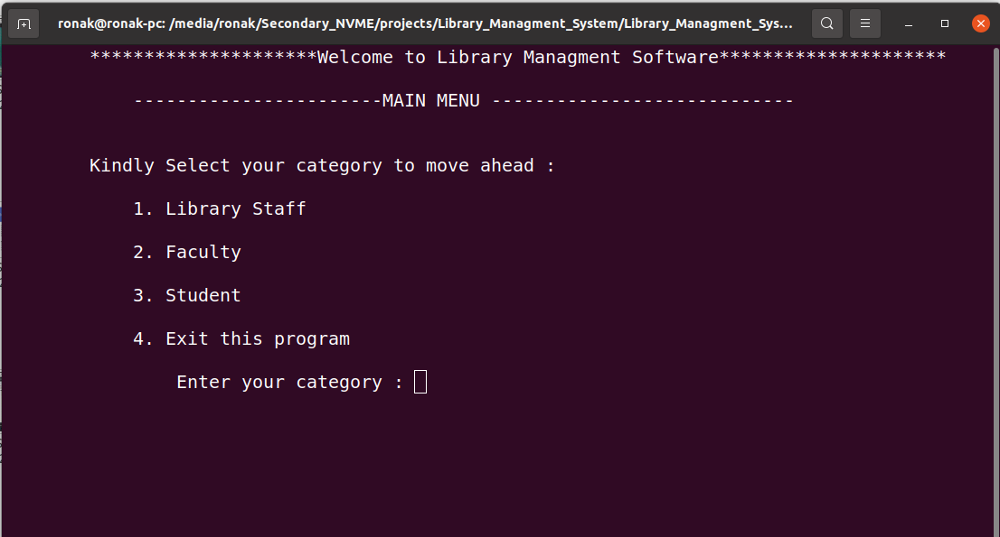
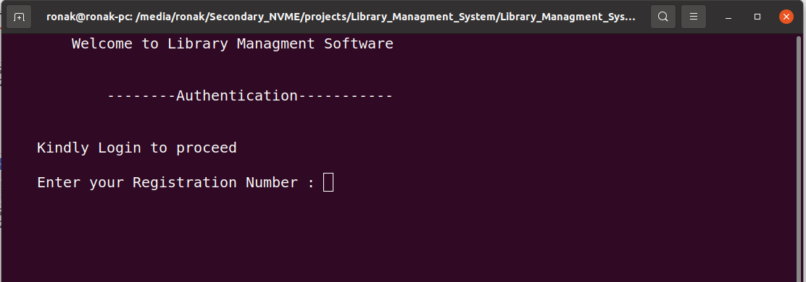
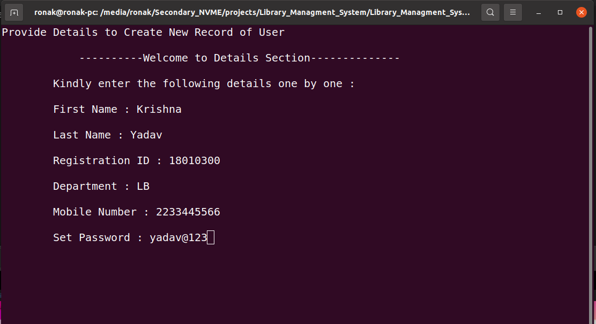
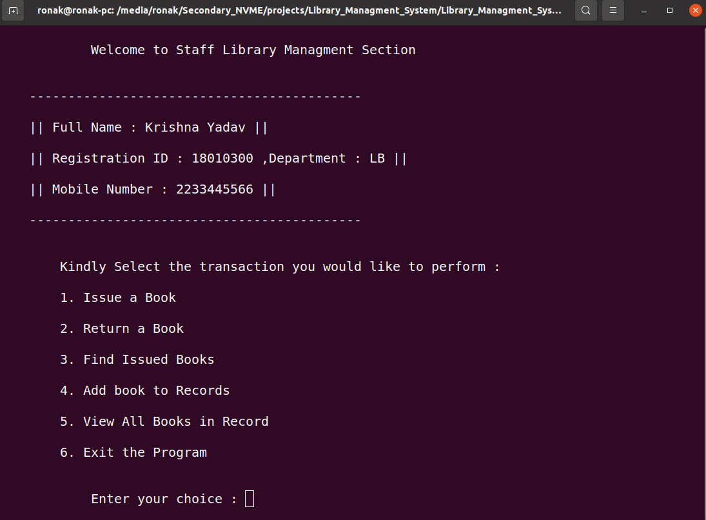
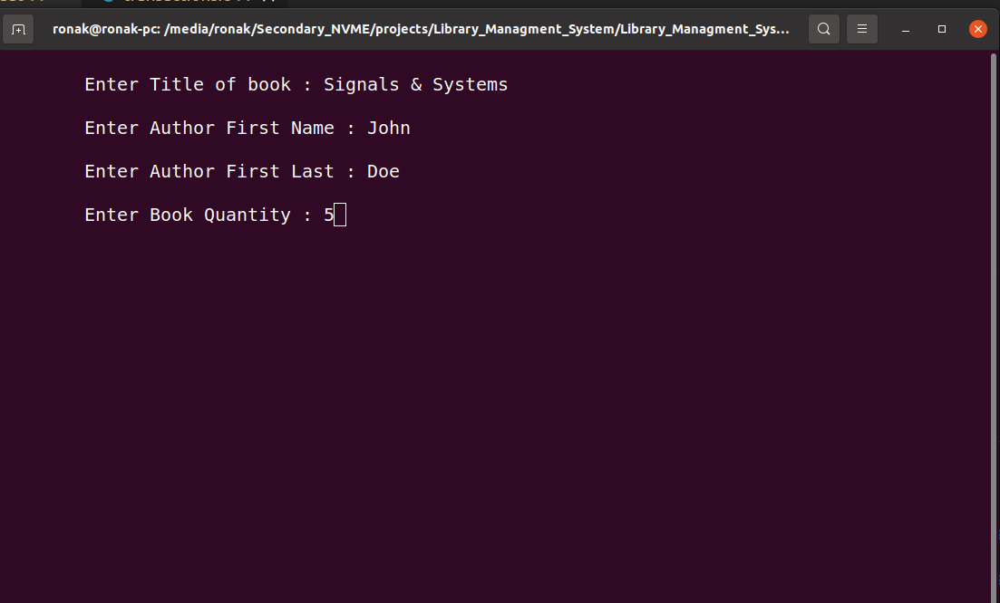
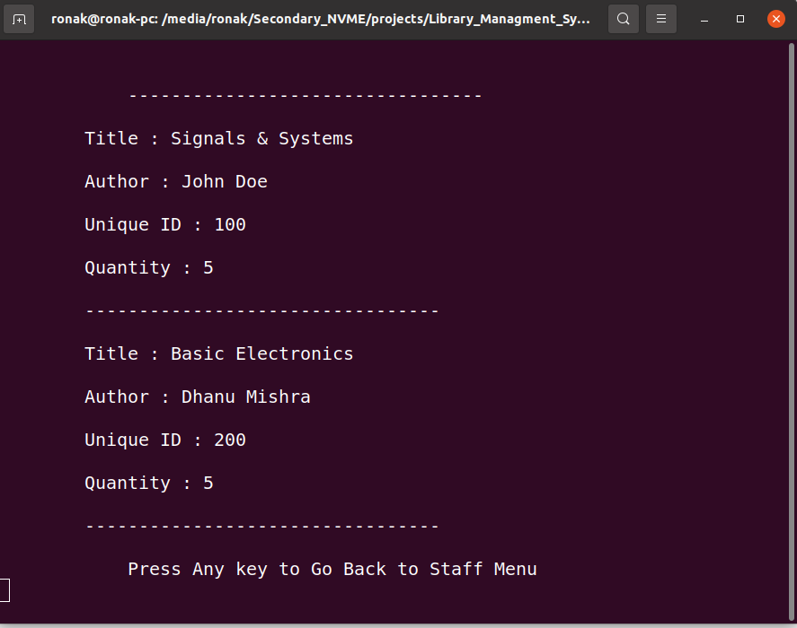
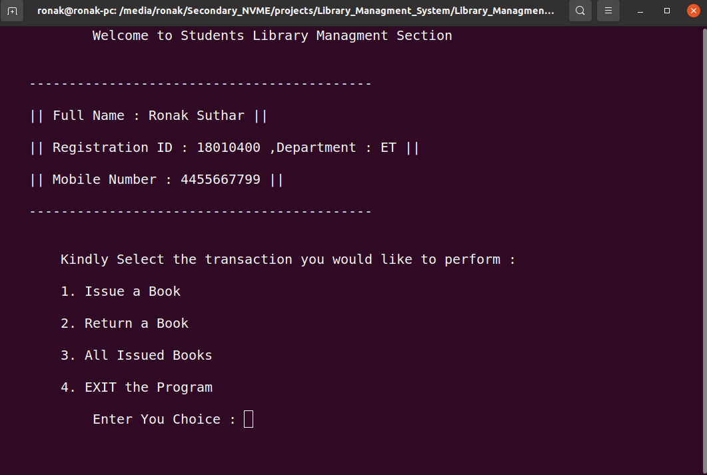

# Library Managment Software

- Language & Tool : 

- Prequiste installations required to run the program are Git,GCC Complier

- Clone the Project :

```bash
    git clone git@github.com:ronak-suthar/Library_Managment_System.git
```
- Once into the Directory then compile and create executable using
```bash
    gcc src/main.c implementation/*.c -o lms
```
- Once Successfully Compiled then you can run the exectable using
```bash
    ./lms
```


### Flow of Program 

-  First Thing that is displayed to user is the Main Menu Were they have to choose their category
    - 

-  Next to step to choose category and authenticate ourselves 
    - If our record exists already then we login
    - Else we create our record and then move ahead
    image
    - Lets Create Record as a Library staff Category.
    
    
- Once we haved logged in we get options to perform as per our category
    - For example these are operations that a Library staff can perform
    
- Let move to other part were a librarian is managing the library
    - Let us Add New Books to Record
    
    - View All Books In Record
    
- Let's Login as a Student
    - 
- We can issue , view issued books and return books as a student ot faculty

# Thank You For Checking This Repo Out !
# Will Add More features later like Fine for returing after due date and others...

